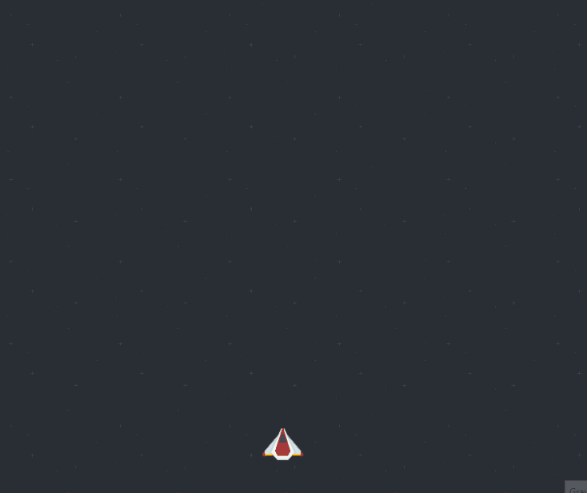
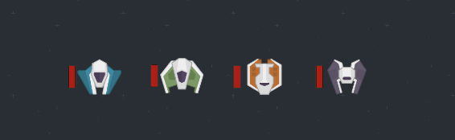
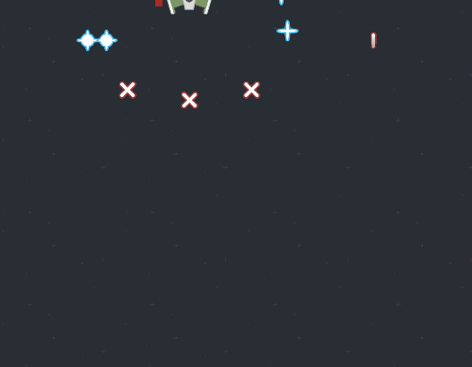
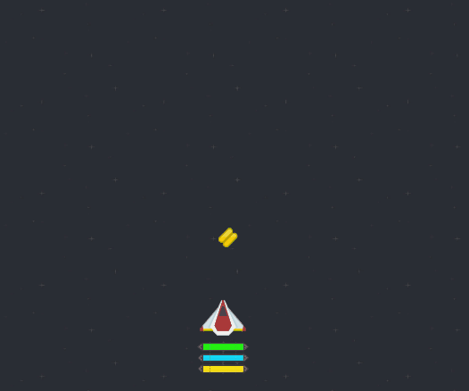
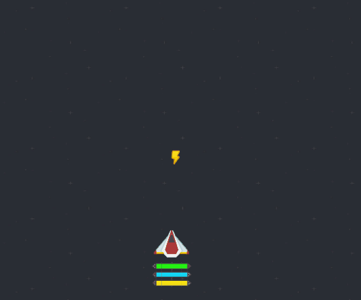
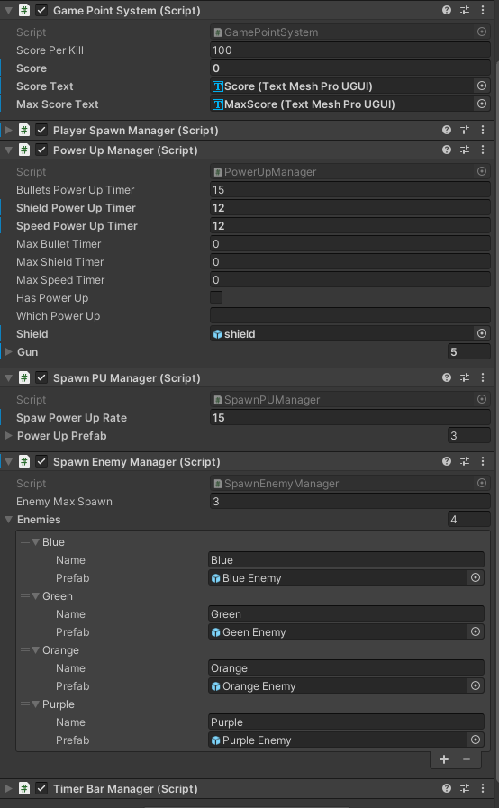

# Shot'em UP
  
## Description
  
Shoot'em Up is a simple single player fast pace space shooter made in [Unity][1]. Project design for an interview test, with a few cool features as [power ups](#Power-Ups), multiple [enemies](#Enemies) and types of [guns](##Enemies).

  
<h4 align="center">

<h4/>  
  
* [Game Obejctive](#Game-Objective)  
* [Enemies](#Enemies)  
* [PowerUps](#Power-Ups) 
* [Unity Design](#Unity-Design)  
  
  
## Game Objective
  
 The game objective is simple as kill as many enemies you can to beat your own high score.

 The player can take only one hit, so be carefull and fast!  
 

   
## Enemies
  
There are 4 enemies to fight off with. They don't really have a name, so we go by color.
 
 
   
Click to expand!

   
 
  * Blue
  * Green            
  * Orange
  * Purple
  

 Each enemy has its own guns, with diferent shoot styles, health and speed.

 some can take two or three hits to kill. They have their life bar attached.
  
  
   
  
     
    
## Power Ups   
  
  There are 3 power ups for the player to pick up.
  
 
   
Click to expand!

       
  * Bullets
  * Shield
  * SpeedUp  
  
  
 As the player grabs it, the timer bar appears bellow and follow the player.

 each bar has its own color for especific power up. And shows the player exacly how much time last that power up.
  
  
   
    
  
  
## Unity Design
  
  
  Pretty much every feature can be modify on the Unity inspector. 
    
from player and enemy type of gun, to health and enemy spawn rate.
  
  
 
   
Click to expand!

  
   
    
  
 

  
  
  
___
  
Hope you enjoy the game and hire me :wink:  :octocat:
  
  
  [1]: https://unity.com/pt/solutions/gaming-services
  
  
  
